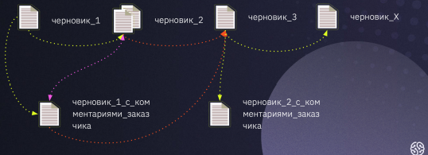

# Контроль версий и синтаксис языка Markdown.

## **Что такое контроль версий и зачем он нужен.**

### **Контроль версий (контроль исходного кода)** — практика, которая позволяет отслеживать изменения исходного кода и управлять ими.
### **Контроль версий необходим, чтобы:**
- хранить разные версии проекта;
- возвращаться к разным версиям проекта.

**Примеры:** версии сайтов (по датам) и документов.
Хранение версий сводится к созданию копий информации на компьютере или сервере. 
Функцию возврата реализуют за счёт восстановления предыдущих версий. 

Таким образом, **система контроля** — это реализованная возможность замены информации 
с использованием сохраненных версий.

### **Примеры использования контроля версий в жизни:**
* Написание нескольких версий одного текста.
* Сохранение в компьютерных играх.
1. Если вы сделали что-то неправильно, вы 
всегда можете вернуться к состоянию, 
когда вас всё устраивало.

* Группа сотрудников пишет текст в течение 
нескольких дней.
1. Когда готов первый черновик, его 
отправляют на ревью коллеге. Пока он 
читает, другие сотрудники продолжают 
работу над текстом.

И когда ревьюер «выкатывает» комментарии 
к первой версии черновика, у команды уже 
появился «Черновик 2». После внесения 
правок появляется ещё и «Черновик 3». 
Файлы множатся и работа усложняется.

* Чтобы избежать описанной выше ситуации, команда обычно принимает правила именования 
и сортировки файлов. Но этого недостаточно для комфортной работы: всё равно приходится 
контролировать, когда пришёл документ, кто его владелец, каким образом документ был 
создан. 
Можно организовать совместную работу с помощью сервиса Google Docs, но в реальных 
бизнес-ситуациях это не всегда удобно: чтобы контролировать изменения документа, его 
приходится править и перечитывать. А ещё работа в облачных сервисах — это угроза 
безопасности.

## Команды Git

Осваивать Git проще процессе редактирования текстовых файлов. Markdown – язык разметки, 
который позволяет форматировать текст. Для написания в редакторе VS Code используется 
синтаксис языка.

Все команды задаём при помощи написания кода в терминале.

Прежде чем создавать репозиторий и инициализировать Git, проверим текущую установленную 
версию пограммы. Для этого в терминале введём команду:
**git --version**

Если Git установлен на компьютер, вы увидите его текущую версию.

### **Создание Git-репозитория:**

- Берём локальный каталог, который не 
находится под версионным контролем, 
и превращаем его в репозиторий.
- Клонируем существующий репозиторий 
из любого места.

**Команда git init**
- Инициализация: указываем папку, в которой 
git начнёт отслеживать изменения
- В папке создаётся скрытая папка .git

**Команда git status**

- Показывает текущее состояние гита, есть 
ли изменения, которые нужно закоммитить 
(сохранить)

! Чтобы вызвать ранее введённую команду, 
пользуемся стрелками на клавиатуре. 
Перебираем недавно введённые команды 
нажатием стрелки «вверх».

**Команда git add**
- добавляет содержимое рабочего каталога 
в индекс (staging area) для последующего коммита. Эта команда дается после добавления 
файлов. Писать название целиком не обязательно: терминал дозаполнит данные автоматически.

**Команда git commit**
- зафиксировать или сохранить

По умолчанию git commit использует лишь этот индекс, так что вы можете использовать git add 
для сборки слепка вашего следующего коммита.
Команда git commit берёт все данные, добавленные в индекс с помощью git add, и сохраняет их 
слепок во внутренней базе данных, а затем сдвигает указатель текущей ветки на этот слепок.

**Команда git log**
- Журнал изменений
- Перед переключением версии файла в Git 
используйте команду git log, чтобы увидеть 
количество сохранений

**Команда git checkout**
- Переключение между версиями. 
- Для работы нужно указать не только 
интересующий вас коммит, но и вернуться 
в тот, где работаем, при помощи команды 
git checkout master.

!Нажатие клавиши ‘q’ возвращает 
в исходное окно терминала.

**Команда git diff**
- Показывает разницу между текущим файлом 
и сохранённым
- Перед переключением версии файла в Git 
используйте команду git log, чтобы увидеть 
количество сохранений

## Синтаксис языка Markdown.

Настоящий документ предназначен для ознакомления пользователя с функциональными возможностями языка разметки Markdown. Markdown – это облегченный язык разметки, который является инструментом преобразования кода в HTML. Главной особенностью данного языка является максимально простой синтаксис, который служит для упрощения написания и чтения кода разметки, что, в свою очередь, позволяет легко его корректировать. Теперь рассмотрим более подробно функции языка разметки Markdown.

Markdown не является заменой HTML. Синтаксис Markdown достаточно ограничен, и соответствует лишь небольшому подмножеству элементов HTML. Он включает в себя следующие элементы:

1. Блочные элементы
- Параграфы и разрывы строк;
- Заголовки;
- Цитаты;
- Списки
- Блоки кода;
- Горизонтальные (разделительные) линии.
2. Строчные элементы
- Ссылки;
- Выделение текста;
- Кодовые фрагменты строк;
- Изображения.
3. Дополнительные элементы
- [Обратный слеш](#Backslash Escapes);
- [Автоматические ссылки](#Automatic Links);
- Специальные символы HTML.

Более подробно с перечисленными функциями можно ознакомиться в разделе «Описание синтаксиса».

## ОПИСАНИЕ СИНТАКСИСА

### **Блочные элементы**

#### **_Параграфы и разрывы_** строк
Для того, чтобы создать параграф с использованием синтаксиса языка Markdown, достаточно отделить строки текста одной (или более) пустой строкой (пустой считается всякая строка, которая не содержит в себе ничего, кроме пробелов и символов табуляции). Для того, чтобы вставить видимый перенос строки (элемент  ) необходимо окончить строку двумя пробелами и нажатием клавиши «Enter». Многие элементы синтаксиса Markdown выглядят и работают гораздо лучше в случае, когда их форматируют с помощью «жесткого перевода строк» (разделение строк, осуществленное самим пользователем, а не программой автоматически). К таким элементам относятся цитаты, списки и пр.

#### **Заголовки**

Язык разметки Markdown поддерживает 2 стиля обозначения заголовков: подчеркивание и выделение символом («#»). Выделение заголовков с помощью подчеркивания производится знаками равенства («=») в случае, если заголовок первого уровня, и дефисами («-») в случае, если заголовок второго уровня. Количество знаков подчеркивания не ограничивается. При выделении заголовков с помощью символа («#») используется от одного до шести данных символов, которые устанавливаются в начале строки (перед заголовком). В данном случае количество символов соответствует уровню заголовка. Кроме того, заголовок возможно снабдить закрывающимися символами («#»), хотя это и не является обязательным. Количество закрывающихся символов не обязано соответствовать количеству начальных символов. Уровень заголовка определяется по количеству начальных символов.

Заголовки первого и второго уровней, выполненные с помощью подчеркивания, выглядят следующим образом:

Заголовок первого уровня
========================
Заголовок второго уровня
-------------------------
Заголовки первого, третьего и шестого уровней, выполненные с помощью символа («#»), выглядят следующим образом:

#  Заголовок первого уровня
### Заголовок третьего уровня
###### Заголовок шестого уровня
Приведенные выше заголовки, выполненные с помощью символа («#») тождественны следующим:

#  Заголовок первого уровня #
### Заголовок третьего уровня ###
###### Заголовок шестого уровня ######
В результате на экран выводится следующее:

Заголовок первого уровня
Заголовок второго уровня
Заголовок первого уровня
Заголовок третьего уровня
Заголовок шестого уровня

### **Цитаты**

Для обозначения цитат в языке Markdown используется знак «больше» («>»). Его можно вставлять как перед каждой строкой цитаты, так и только перед первой строкой параграфа. Также синтаксис Markdown позволяет создавать вложенные цитаты (цитаты внутри цитат). Для их разметки используются дополнительные уровни знаков цитирования («>»). Цитаты в Markdown могут содержать всевозможные элементы разметки. Цитаты в языке Markdown выглядят следующим образом:

>Это пример цитаты,
>в которой перед каждой строкой
>ставится угловая скобка.

>Это пример цитаты,
в которой угловая скобка
ставится только перед началом нового параграфа.
>Второй параграф.
Вложение цитаты в цитату выглядит следующим образом:

> Первый уровень цитирования
>> Второй уровень цитирования
>>> Третий уровень цитирования
>
>Первый уровень цитирования
В результате на экран выводится следующее:

Это пример цитаты, в которой перед каждой строкой ставится угловая скобка.

Это пример цитаты, в которой угловая скобка ставится только перед началом нового параграфа.

Второй параграф.

Вложенная цитата:

Первый уровень цитирования

Второй уровень цитирования

Третий уровень цитирования

Первый уровень цитирования

Уровень цитирования не может превышать 15-й.

### **Списки**

Markdown поддерживает упорядоченные (нумерованные) и неупорядоченные (ненумерованные) списки. Для формирования неупорядоченный списков используются такие маркеры, как звездочки, плюсы и дефисы. Все перечисленные маркеры могут использоваться взаимозаменяемо. Для формирования упорядоченных списков в качестве маркеров используются числа с точкой. Важной особенностью в данном случае является то, что сами номера, с помощью которых формируется список, не важны, так как они не оказывают влияния на выходной HTML код. Как бы ни нумеровал пользователь список, на выходе он в любом случае будет иметь упорядоченный список, начинающийся с единицы (1, 2, 3…). Эту особенность стоит учитывать в том случае, когда необходимо использовать порядковые номера элементов в списке, чтобы они соответствовали номерам, получающимся в HTML. Упорядоченные списки всегда следует начинать с единицы. Маркеры списков обычно начинаются с начала строки, однако они могут быть сдвинуты, но не более чем на 3 пробела. За маркером должен следовать пробел, либо символ табуляции. При необходимости в список можно вставить цитату. В этом случае обозначения цитирования ( «>» ) нужно писать с отступом. Упорядоченные списки выглядят следующим образом:

1.	Проводник
2.	Полупроводник
3.	Диэлектрик
Неупорядоченные списки выглядят следующим образом:

* Проводник
* Полупроводник
* Диэлектрик
Или

- Проводник
- Полупроводник
- Диэлектрик
Или

+ Проводник
+ Полупроводник
+ Диэлектрик
На выходе всех трех перечисленных вариантов имеется один и тот же результат. В результате на экран выводится следующее:

Проводник
Полупроводник
Диэлектрик
и

Проводник
Полупроводник
Диэлектрик
Цитата, вставленная в список, выглядит следующим образом:

1. Элемент списка с цитатой:

    > Это цитата
    > внутри элемента списка.

 2. Второй элемент списка
В результате на экран выводится следующее:

Элемент списка с цитатой:

Это цитата внутри элемента списка.

Второй элемент списка

При вставке цитат в элементы списка важно учитывать, что элементы списка должны находиться на одном уровне, а цитаты должны указываться с отступом. В случае, если правило с единым уровнем списка не соблюдается, следующий после цитаты элемент списка будет автоматически нумероваться цифрой «1.». Кроме того, при необходимости в список можно вставить исходный код. В этом случае его нужно писать с двойным отступом – 8 пробелов или 2 символа табуляции.

Элемент списка, содержащий исходный код

 <исходный код > 

### **Блоки кода**

Отформатированные блоки кода используются в случае необходимости процитировать исходный код программ или разметки. Для создания блока кода в языке Markdown необходимо каждую строку параграфа начинать с отступа, состоящего из четырех пробелов или одного символа табуляции. Блок кода продолжается до тех пор, пока не встретится строка без отступа (или конец текста). Внутри блока кода амперсанды («&») и угловые скобки («<» и «>») автоматически преобразуются в элементы HTML разметки. Кроме того, следует отметить, что внутри блоков кода обычный синтаксис Markdown не обрабатывается. Блок кода в Markdown выглядит следующим образом:

Это обычный параграф:

Это блок кода

### **Горизонтальные линии (разделители)**

Для того чтобы создать горизонтальную линию с использованием синтаксиса языка Markdown, необходимо поместить три (или более)дефиса или звездочки на отдельной строке текста. Между ними возможно располагать пробелы. Горизонтальные линии в Markdown выглядят следующим образом:

Первая часть текста, который необходимо разделить
***
Вторая часть текста, который необходимо разделить
Или

Первая часть текста, который необходимо разделить

---

Вторая часть текста, который необходимо разделить
В результате на экран выводится следующее:

Первая часть текста, который необходимо разделить

Вторая часть текста, который необходимо разделить

При использовании данного инструмента важно помнить, что после первой части текста и перед второй необходимо оставлять пустую строку. Данное правило необходимо соблюдать только при использовании дефисов. Если его не соблюдать, на экран будет выведен заголовок второго уровня и строка обычного текста. При использовании символа звездочки данным правилом можно пренебречь.

...........
